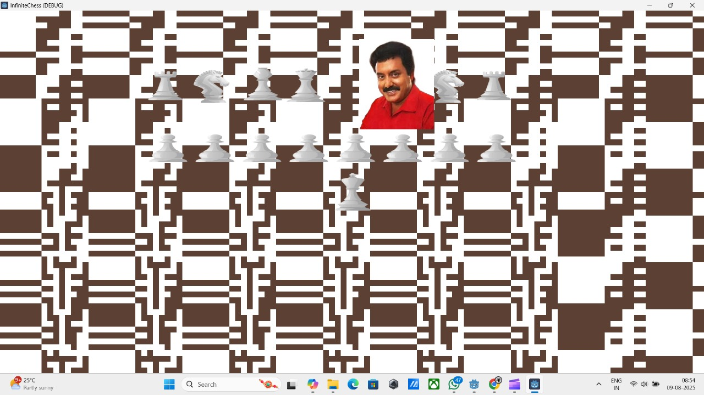
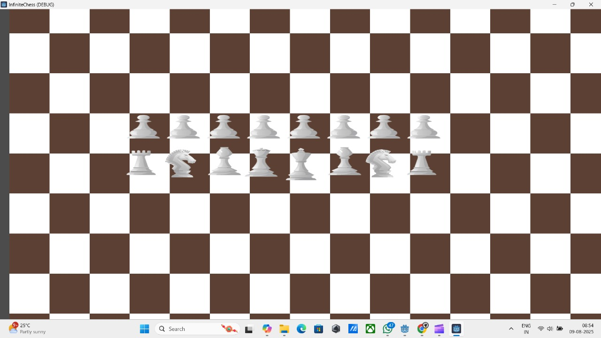
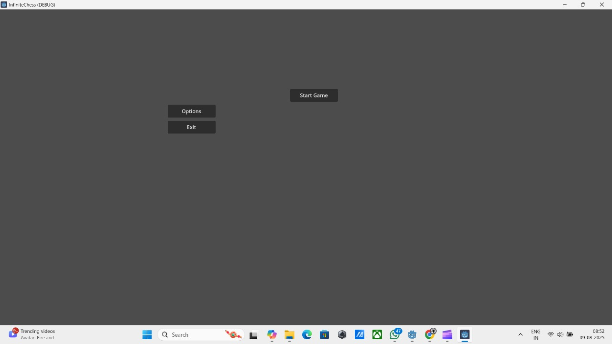

# INFINITE CHESS 🎯

## Basic Details
### Team Name: IDLI KADA

### Team Members
- Team Lead: VIVEK KRISHNAN M J - COLLEGE OF ENGINEERING,PERUMON
- Member 2: MUHAMMED RAFZAN R - COLLEGE OF ENGINEERING,PERUMON

### Project Description
Most Buggy Game in the World is a chaotic twist on chess where nothing works as intended—pieces teleport randomly, rules break mid-game. It’s less about strategy and more about surviving the glitches.

### The Problem (that doesn't exist)
chess is to strategic and good for brain.

### The Solution (that nobody asked for)
Make the most brainrot chess in the world.

## Technical Details
### Technologies/Components Used
For Software:
- GDscript
- GODOT
### Implementation
For Software:Tried to implement a multiplayer infinte map chess but because the game was becoming buggy I added more bugs and trolls to the point where the game became an unplayable buggy mess. Used 2d nodes and user interfaces to create the game and gdscript programming to crreate the main scene. It was then followed by creation of 2d scenes for characters. Lastly random function and audioplayer nodes were to make the game totally out of control. 
# Installation
1.Download the game files from our totally safe and definitely not suspicious source.

2.Extract the folder (if your unzipper crashes, congratulations—you’re already experiencing the game).

3.Install Godot Engine (preferably the same version we forgot to note down).

4.Open the project in Godot. If it doesn’t open, try again… or don’t.

# Run
1.Press the Run button in Godot.

2.Wait for the game to launch (may take between 2 seconds and 2 hours—depends on the bugs).

3.Start a match.

4.Enjoy the chaos. Or uninstall in fear.

### Project Documentation
For Software:The project began as an attempt to create a multiplayer infinite-map chess game in Godot. However, due to persistent and hilarious bugs during development, the concept pivoted into intentionally making the Most Buggy Game in the World.

The core design involves:

Infinite Board Generation: Chess pieces can roam endlessly, but pathfinding errors cause them to randomly teleport.

Randomized Piece Behavior: Pieces occasionally refuse to move, move in the wrong direction, or swap places with other pieces for no reason.

Troll Mechanics: Kings may declare checkmate on themselves, pawns might become queens without reaching the last rank, and captured pieces sometimes return to the board uninvited.

Chaos Engine: A combination of random number generators and audio triggers ensures that the game feels less like chess and more like a comedy skit gone wrong.

The game uses 2D scenes for all elements, UI nodes for player interaction, and GDScript for logic. The bugs are not glitches to be fixed—they are features to be celebrated.

# Screenshots (Add at least 3)

Game after playing for a few seconds.Here convincing star randomly appears for 5-6 seconds.This is one of the three thing that can happen.One of it's include randomly going back to the main menu.

Game at the beginning , before playing.

It is the main menu.

### Project Demo
# Video
[▶ Watch Video](videos/demo.mp4)
*Explain what the video demonstrates*

## Team Contributions
- Vivek Krishnan M J: [Specific contributions]
- Muhammed Rafzan R: [Specific contributions]

---
Made with ❤️ at TinkerHub Useless Projects 

